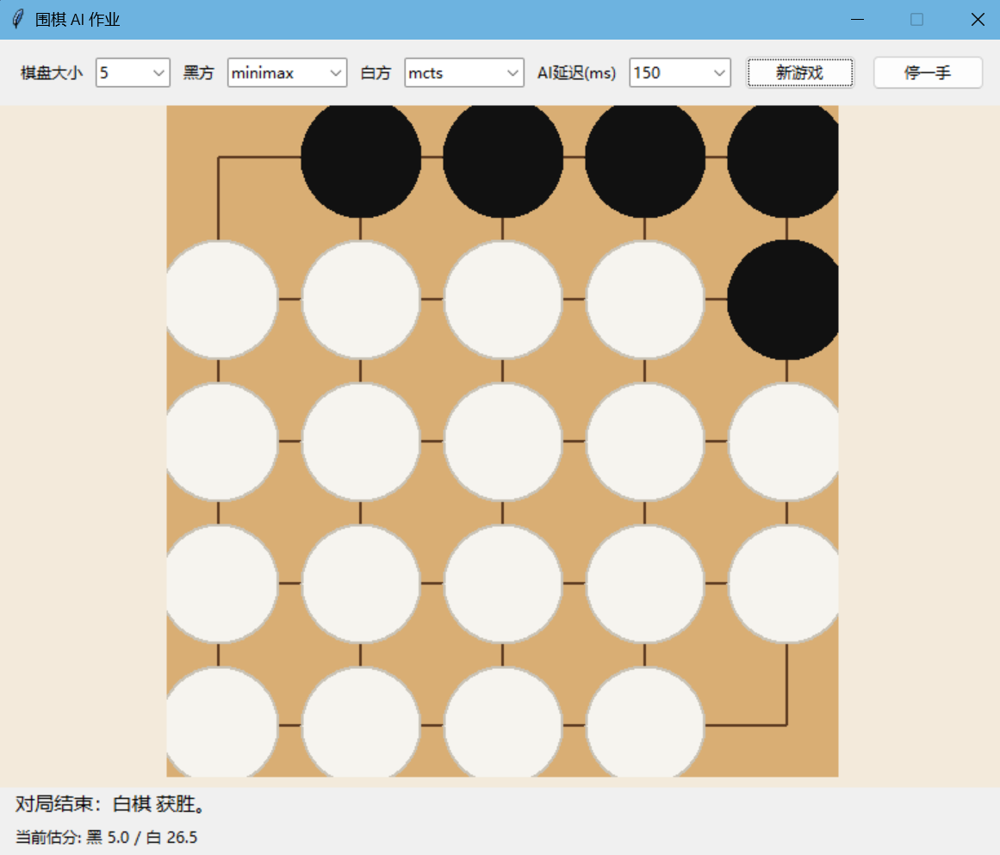

# 围棋 AI 项目报告

项目地址：https://github.com/Acoustasonic/ai-course-hw1

## 1. 项目整体介绍

本项目围绕 5x5 围棋环境，实现了三个智能体与一个人机交互界面：

- 随机合法落子的 `RandomAgent`
- 基于蒙特卡洛树搜索的 `MCTSAgent`
- 基于 `Minimax + Alpha-Beta` 的 `MinimaxAgent`
- 基于 Tkinter 的图形界面 `gui.py`

## 2. 算法设计

### 2.1 随机 AI

- 调用 `game_state.legal_moves()` 枚举当前局面下所有合法着法；
- 默认过滤 `resign`，避免随机策略在开局阶段直接认输，影响实验可读性；
- 使用 `random.choice()` 在合法着法中均匀采样，并返回对应 `Move`。

该策略的优点是实现简单、运行速度快，因此很适合作为下限参考。如果一个更复杂的智能体在对战 `RandomAgent` 时没有明显优势，通常说明其搜索过程、估值逻辑或规则调用存在问题。

### 2.2 MCTS AI

本实现中，每个搜索节点 `MCTSNode` 保存以下信息：

- 当前局面 `game_state`
- 父节点与子节点列表
- 从父节点走到该节点所对应的 `move`
- 节点访问次数 `visit_count`
- 累积价值 `value_sum`
- 启发式先验 `prior`
- 尚未展开的合法着法 `unexpanded_moves`

其中，`value_sum / visit_count` 表示该节点在当前行动方视角下的平均价值。这个视角设定很重要，因为搜索树中每下一层，轮到行动的玩家就会切换一次。因此在父节点选择子节点时，代码中使用的是 `1 - child.value`，将子节点视角下的价值转换回父节点视角。

#### 2.2.1 Selection：基于 UCT 的路径选择

在选择阶段，从根节点开始递归地选择最值得继续探索的子节点，直到到达叶节点或终局节点。

本实现对应的评分可以概括为：

```text
UCT(child) = (1 - child.value) + c * child.prior * sqrt(ln(parent_visits) / child_visits)
```

其中：

- `1 - child.value` 用于把价值转换到父节点视角；
- `c` 为探索常数，本实现默认为 `1.414`；
- `child.prior` 是额外加入的启发式先验，用于让看起来更合理的着法在早期更容易被搜索到。

这种做法的好处是：访问次数较少的节点会因为探索项而获得更高分数，但一旦某些节点被证明质量较差，它们的平均价值会逐步把它们压下去。

#### 2.2.2 Expansion：在叶节点上生成后继

当搜索到尚未展开的叶节点时，算法会根据当前局面的合法着法生成所有候选子节点。每个子节点都对应一个应用该着法后的新 `GameState`。这一阶段并不立即深入整棵子树，而是只把下一层候选动作显式建立出来，让后续模拟有入口。

这里做了一个工程化选择：子节点只在第一次访问叶节点时统一生成一次，之后重复利用。这样可以避免在后续搜索中反复构造相同状态，减少不必要的对象开销。

#### 2.2.3 Simulation：限制深度的快速 rollout

传统 MCTS 常使用完全随机 rollout，即从当前局面一直随机下到终局。但在围棋中，完全随机模拟往往会出现大量低质量着法，例如无意义填空、明显送吃等，从而让统计结果非常噪声化。

因此，本项目中 rollout 采用启发式随机：

- 不再从所有合法走法中均匀采样；
- 先用简单棋理对着法打分；
- 再从高分候选中随机选择，而不是只取唯一最优。

这样做兼顾了两个目标：

- 保留一定随机性，避免搜索退化成固定策略；
- 提高模拟质量，让统计出的胜率更有参考意义。

另外，为了控制每一步决策的时间开销，本实现对 rollout 设置了最大深度 `rollout_depth`。若在该深度内未到达终局，就不继续完全展开，而是使用一个轻量启发式评估函数对当前局面打分。这样可以避免后期无穷拖长的模拟链条，把主要计算资源留给更多轮搜索。

#### 2.2.4 Backup：沿路径反向传播结果

模拟完成后，会得到一个从当前节点行动方视角出发的结果值：

- `1.0` 表示该视角下获胜；
- `0.0` 表示失败；
- `0.5` 表示和局或估值中性。

回传时，从当前节点一路回到根节点：

- 每经过一个节点，访问次数 `visit_count += 1`
- 同时将价值加到 `value_sum`
- 然后执行 `current_value = 1 - current_value`

#### 2.2.5 最终落子策略

搜索结束后，不是直接选择平均价值最高的着法，而是优先选择访问次数最多的子节点。原因在于：

- 访问次数体现了搜索过程对该分支的资源投入；
- 一个真正稳定的好着法，通常会在多轮模拟后持续吸引访问；
- 直接使用价值均值有时会受到少量高波动样本的影响。

在默认设置下，本项目采用最大访问次数作为最终决策准则；若温度参数不是 1，则可按访问次数分布随机采样。

### 2.3 MCTS 优化

#### 1. 启发式 rollout

rollout 阶段不再完全随机，而是对候选着法计算一个简单分数。评分主要由以下几部分组成：

- `capture_bonus`：该着法是否能直接提子，提子数越多分越高；
- `liberty_bonus`：落子后新棋串拥有多少气，气多通常意味着更安全；
- `connection_bonus`：是否与己方已有棋子相邻，鼓励连络；
- `local_bonus`：是否落在已有战斗区域附近，减少完全脱离局部的空着；
- `center_distance`：离棋盘中心越远，略微扣分，鼓励开局与中盘更集中。

这种评分本质上是一个弱棋理模型。它不能代替真正的策略网络，但可以把最差的一批随机着法过滤掉，使 rollout 更像会下棋但不强的人而不是纯随机的选择。这对小样本搜索尤其重要，因为本项目默认每步只有几十轮模拟，如果 rollout 质量过差，统计结果会非常不稳定。

#### 2. 限制模拟深度

`play.py` 中默认给 MCTS 设置：

- `num_rounds = 60`
- `rollout_depth = 20`

也就是说，每次决策执行 60 轮模拟，每轮 rollout 最多向后展开 20 步。到达深度上限后，使用快速局面评估函数估计胜率，而不是一直模拟到完全终局。

这个参数组合是精度和效率的折中：

- 若 `num_rounds` 太小，MCTS 对局面采样不足，选择容易受偶然性影响；
- 若 `num_rounds` 太大，GUI 和命令行对弈会明显变慢；
- 若 `rollout_depth` 太浅，评估过早，模拟信息不够；
- 若 `rollout_depth` 太深，后期收官会消耗大量时间在低价值填空上。

在 5x5 棋盘上，`60 / 20` 的组合可以保证每步搜索时间仍在可接受范围内，同时比完全随机落子有明显棋力提升。

#### 3. 启发式先验与残局 pass 处理

标准 UCT 中所有子节点通常被一视同仁。本实现中，为不同落子赋予了简单先验：

- 提子、连络、局部应手得到更高先验
- `pass` 的先验较低，只在残局阶段显著参与搜索

另外，为了减少 5x5 小棋盘上的“无意义填空”，我增加了残局判定逻辑：

- 当空点较少、无明显提子机会且最佳局部着法分数很低时，允许主动 `pass`
- 当局面已拖入收官尾声时，强制提高 `pass` 倾向，减少搜索在低价值填点上浪费时间

在实际工程中，残局处理往往比中盘搜索更容易拖慢程序。原因是：

- 可下的点虽然还很多，但其中大部分价值非常接近；
- rollout 容易把时间花在对结果影响极小的填空和官子上；
- 若双方都不愿意 `pass`，对局会在小棋盘上异常拖长。

因此，我额外加入了两个阈值判断：

- `_should_pass_now()`：当局面已经明显进入尾声时，允许直接 `pass`；
- `_should_force_pass()`：当步数与空点数都表明对局已接近结束时，提高强制收官倾向。

#### 4. 截断后的快速估值函数

当 rollout 到达最大深度后，本实现并不是简单返回 0.5，而是构造一个轻量估值：

- 地盘差
- 棋子差
- 总气数差

然后通过 `tanh` 压缩到 `(0, 1)` 区间，映射为概率型结果值。这样做的优点是：

- 与 backup 阶段的胜率表达兼容；
- 能让明显领先但尚未终局的局面得到合理正反馈；
- 避免深度截断后大量节点都被视为完全相同。

### 2.4 Minimax

选做部分实现了 Minimax 搜索，并在此基础上加入 Alpha-Beta 剪枝。

#### 搜索方法

- 在 `select_move()` 中对所有候选着法逐一展开；
- 对后继局面调用 `alphabeta()`；
- 最大层表示“根玩家”收益最大化，最小层表示对手收益最大化。

本项目中由于棋盘只有 5x5，搜索深度设置为 3 层时依然有实际可运行性，因此 Minimax 在实验中表现出较强竞争力。

#### 评估函数

局面评估采用轻量启发式：

- 地盘差
- 棋子数量差
- 棋串总气数差

评估值统一从根玩家视角计算。若已到终局，则返回大正值或大负值，确保终局优先级高于普通中间局面。

更具体地说，当前实现中地盘差的权重最大，其次是棋子差和气数差。这种设置的考虑是：

- 在围棋中，最终胜负由实地决定，因此地盘相关信息应拥有最高权重；
- 棋子数差可以近似反映提子和局部战斗中的交换收益；
- 气数差则作为安全性和活力的近似指标，用来补充静态地盘评价的不足。

该评估函数显然不具备职业级围棋理解能力，但对 5x5 小盘面已经足够产生区分度。尤其在接触战频繁、局面紧凑的情况下，棋子数和气数往往与最终结果有较强相关性。

#### Alpha-Beta 剪枝

在搜索过程中维护 `alpha` 与 `beta`：

- 最大层：若 `value >= beta`，则直接剪枝
- 最小层：若 `value <= alpha`，则直接剪枝

在小棋盘环境里，Alpha-Beta 剪枝的收益非常明显，因为它能把不少显然不会被选中的候选局面提前丢掉，从而让相同搜索深度下的运行时间大幅下降。

#### 置换表缓存

用 `(next_player, zobrist_hash)` 作为缓存键，保存：

- 已评估深度
- 局面值
- 标记位

这样可以减少重复局面的重复计算。

加入缓存的动机在于：不同的走子顺序可能会转移到同一个局面，尤其在小棋盘上，这类重复比想象中更常见。如果不缓存，Minimax 会对这些局面反复递归，造成明显浪费。

本项目中的缓存策略采用深度优先替换，即只有在当前搜索深度不低于旧结果时才更新缓存。这样可以尽量保留信息量更高的结果，避免浅层搜索覆盖深层搜索的有效信息。

#### Minimax 的残局 pass 处理

和 MCTS 一样，Minimax 在空点较少、无提子机会且当前已领先时，也会主动考虑 `pass`，减少小盘面中的冗余收官。

这一设计是后期加入的工程化修正。纯理论 Minimax 若没有专门的残局处理，在 5x5 棋盘上也可能继续尝试一些价值极小的填空着法，导致对局变长。加入简单 `pass` 判断后，Minimax 的终局行为更稳定，也更适合 GUI 演示。

## 3. 图形界面设计

项目使用 Tkinter 实现了一个简洁的人机对弈界面，主要功能如下：

- 显示 5x5 或 9x9 棋盘
- 显示黑白棋子与最后一手标记
- 鼠标点击交叉点落子
- 可选择人类执黑或执白
- 可选择对手为 `random / mcts / minimax`
- 支持“新游戏”和“停一手”
- 界面底部显示当前轮次状态与粗略计分信息

AI 落子通过后台线程完成，避免界面在思考期间卡死。

具体运行效果如下：



## 4. 实验设置

实验环境如下：

- 操作系统：Windows
- Python 版本：`Python 3.11.4`
- 棋盘大小：`5x5`
- MCTS 参数：`num_rounds = 60`，`rollout_depth = 20`
- Minimax 参数：`max_depth = 3`
- 每组实验对局数：`3`

使用的典型命令如下：

```bash
python play.py --agent1 mcts --agent2 random --size 5 --games 3 --quiet
python play.py --agent1 minimax --agent2 random --size 5 --games 3 --quiet
python play.py --agent1 mcts --agent2 minimax --size 5 --games 3 --quiet
python play.py --agent1 minimax --agent2 mcts --size 5 --games 3 --quiet
python play.py --agent1 mcts --agent2 mcts --size 5 --games 3 --quiet
```

## 5. 实验结果

### 5.1 MCTS vs Random

| 对局设置 | 黑方胜 | 白方胜 | 平局 | 平均步数 | 平均用时 |
| --- | --- | --- | --- | --- | --- |
| MCTS(黑) vs Random(白) | 3 | 0 | 0 | 35.0 | 12.31s |

### 5.2 Minimax vs Random

| 对局设置 | 黑方胜 | 白方胜 | 平局 | 平均步数 | 平均用时 |
| --- | --- | --- | --- | --- | --- |
| Minimax(黑) vs Random(白) | 3 | 0 | 0 | 33.0 | 3.92s |

### 5.3 MCTS vs Minimax

| 对局设置 | 黑方胜 | 白方胜 | 平局 | 平均步数 | 平均用时 |
| --- | --- | --- | --- | --- | --- |
| MCTS(黑) vs Minimax(白) | 0 | 3 | 0 | 31.3 | 16.15s |
| Minimax(黑) vs MCTS(白) | 1 | 2 | 0 | 41.0 | 18.05s |

### 5.4 MCTS 收官调优结果

| 对局设置 | 黑方胜 | 白方胜 | 平局 | 平均步数 | 平均用时 |
| --- | --- | --- | --- | --- | --- |
| MCTS(黑) vs MCTS(白) | 2 | 1 | 0 | 41.3 | 23.72s |

与早期版本相比，`MCTS vs MCTS` 的收官阶段已经明显缩短，强制结算触发频率下降，说明残局 `pass` 策略对小棋盘环境有效。

## 6. 结果分析

### 6.1 MCTS 与随机策略的差异

`MCTS` 对 `Random` 取得 3:0，平均步数为 35.0，平均用时为 12.31s。这说明即使只使用轻量 rollout 和有限轮数搜索，只要能不断统计哪些分支更容易赢，就能明显优于纯随机走子。

其原因主要有两点：

- 搜索会在多轮模拟中逐渐集中到更有希望的分支
- 启发式 rollout 提高了模拟质量，使统计结果更稳定

更具体地看，MCTS 相比随机策略的优势来自两个层面。

第一，MCTS 具有试错后纠偏的能力。随机策略每一步都重新掷骰子，前面的经验不会保留；而 MCTS 在同一个根节点下会多次重复访问同一批候选着法，访问次数和胜率信息会持续积累，因此可以逐渐把搜索资源集中到表现更好的分支上。

第二，MCTS 的 rollout 并非纯随机，而是带有基本棋理偏好。这意味着即使模拟轮数不多，算法也更容易在局部战斗中得到相对合理的后续走势，从而减少明明是好棋，却在随机模拟中被大量坏后续稀释掉的问题。

从实验结果看，MCTS 相比随机策略不仅胜率更高，而且对局过程整体更有结构性。随机 AI 往往会在开局就出现脱离局部、无目的填空或送吃等现象，而 MCTS 通常会优先围绕已有接触区域落子，说明搜索和启发式已经开始发挥作用。

### 6.2 Minimax 的表现

`Minimax` 对 `Random` 同样取得 3:0，平均步数为 33.0，平均用时仅 3.92s，而且整体耗时明显低于 MCTS。这是因为：

- 5x5 棋盘状态空间较小
- 搜索深度只有 3 层，Alpha-Beta 剪枝能有效减少分支
- 启发式评估函数对小盘面有较强区分能力

这一结果说明，在小规模棋盘上，静态评估函数驱动的浅层精搜是非常有竞争力的。  
与 MCTS 相比，Minimax 并不依赖大量 rollout，而是直接查看未来若干步后对局面的影响，因此它在以下场景中更容易占优：

- 局面接近战术决断，例如提子、断点、接应等局部问题较明确；
- 搜索深度足以覆盖关键变化；
- 评估函数对当前棋盘规模足够适配。

Minimax 平均耗时更短也符合预期。MCTS 的核心代价在于同一步要做多次模拟，而 Minimax 在 5x5 上的候选分支虽多，但深度有限且剪枝明显，因此总体计算量较低。

### 6.3 MCTS 与 Minimax 的比较

实验中 `MCTS(黑) vs Minimax(白)` 的结果为 0:3，而 `Minimax(黑) vs MCTS(白)` 的结果为 1:2。这个结果非常值得分析，因为它说明两者并不存在绝对压制关系，而是受到先手优势、局面性质和算法机制的共同影响。

首先，小棋盘环境放大了先手优势。  

5x5 棋盘上可用空间有限，黑棋的第一手往往更容易直接影响中腹或关键接触区域。因此当某个算法执黑时，通常会获得更主动的局面控制权。这也解释了为什么同一组算法在交换黑白后，胜负结构会发生明显变化。

其次，Minimax 和 MCTS 的信息来源不同：

- Minimax 更依赖当前深度内能否看到关键变化；
- MCTS 更依赖多次 rollout 后的统计趋势。

在本项目配置下：

- Minimax 的深度 3 已足以覆盖 5x5 中不少关键战术变化；
- MCTS 默认轮数只有 60，rollout 仍是启发式近似，而非真正高质量价值网络。

因此在一些局部接触战中，Minimax 能凭借浅层精确搜索占优；而在一些更依赖全局平衡与中长期收益的局面里，MCTS 仍有机会凭统计优势追回来。

这说明在当前配置下：

- 小棋盘、浅层搜索时，Minimax 的静态评估函数很有竞争力；
- MCTS 的强度仍然受限于模拟轮数和 rollout 质量；
- 两者都不是绝对的强，而是在不同局面类型下各有优势。

但两者本质不同：

- `Minimax` 更依赖评估函数质量，适合分支较少、可控深度的小盘面
- `MCTS` 更适合大搜索空间，未来可继续通过更强策略网络或价值网络增强

### 6.4 收官行为分析

早期版本的 MCTS 容易在 5x5 棋盘后期反复填空或进行低价值交换，导致对局拖长。调优后加入了：

- 低价值着法识别
- 空点数量阈值
- 残局主动 `pass`

这些改动使得收官效率明显提升，更符合真实围棋中“局势已定时尽快终局”的策略。

从实验数据也可以看出这一点。`MCTS vs MCTS` 的平均步数为 41.3，虽然仍然高于 `MCTS vs Random` 和 `Minimax vs Random`，但相比没有残局控制时已经明显收敛。造成 `MCTS vs MCTS` 对局更长的原因在于：

- 双方都具备一定自保与应手能力，不容易出现快速崩盘；
- 双方都会尽量避免明显亏损着法，因此中后盘会出现更多价值接近的候选点；
- MCTS 的 rollout 带随机性，即使加入启发式，也仍会保留一定探索，导致收官不如 Minimax 直接果断。

加入残局 `pass` 策略后，程序能更早识别继续下也很难改变结果的局面，从而主动终止低收益搜索。  
这类改动虽然看起来像工程技巧，但它对实验可复现性和 GUI 演示体验都非常关键，因为它减少了小棋盘上不必要的超长对局。

## 7. AI使用说明及总结

本项目完成了作业要求中的主要内容：

- 实现了随机围棋 AI
- 实现了带启发式优化的 MCTS AI
- 额外实现了 Minimax + Alpha-Beta + 缓存
- 实现了可运行的人机图形界面
- 通过实验比较了不同方法的行为差异

从实验结果看：

- `Random` 只能作为规则验证基线
- `Minimax` 在小棋盘浅搜索设置下表现较强
- `MCTS` 在加入合适的 rollout 与残局策略后，已经能稳定完成对局并取得较好效果

后续还可以继续改进的方向包括：

- 引入更强的局面评估函数
- 对 MCTS 加入 RAVE 等策略
- 用神经网络替代手工启发式
- 扩展到 9x9 甚至更大棋盘

另外，本项目由我和 codex (GPT-5.4) 共同开发，其中 codex 参与了很多部分，包括代码 TODO 部分框架的编写、算法优化的具体思路、报告大纲的撰写等，我主要负责代码关键逻辑的调整，报告具体细节的撰写等。

我觉得 AI 很适合在作业中负责大部分的 dirty work，把人从 dirty work 中解放出来，将时间和精力投入需要思考和创造力的部分；同时因为本项目对于 AI 而言不算答案不固定的前沿领域，因此在开发的过程中和 AI 的协作也能深化对搜索算法的认识，具体如 MCTS 优化的方向等。我的实验报告主要的框架就是由 GPT 写的，在文段中可以很明显的看出这一点，不过我保留了这些部分，毕竟它确实将算法的优势等清晰地写了出来，我写报告的过程中也学到了很多。